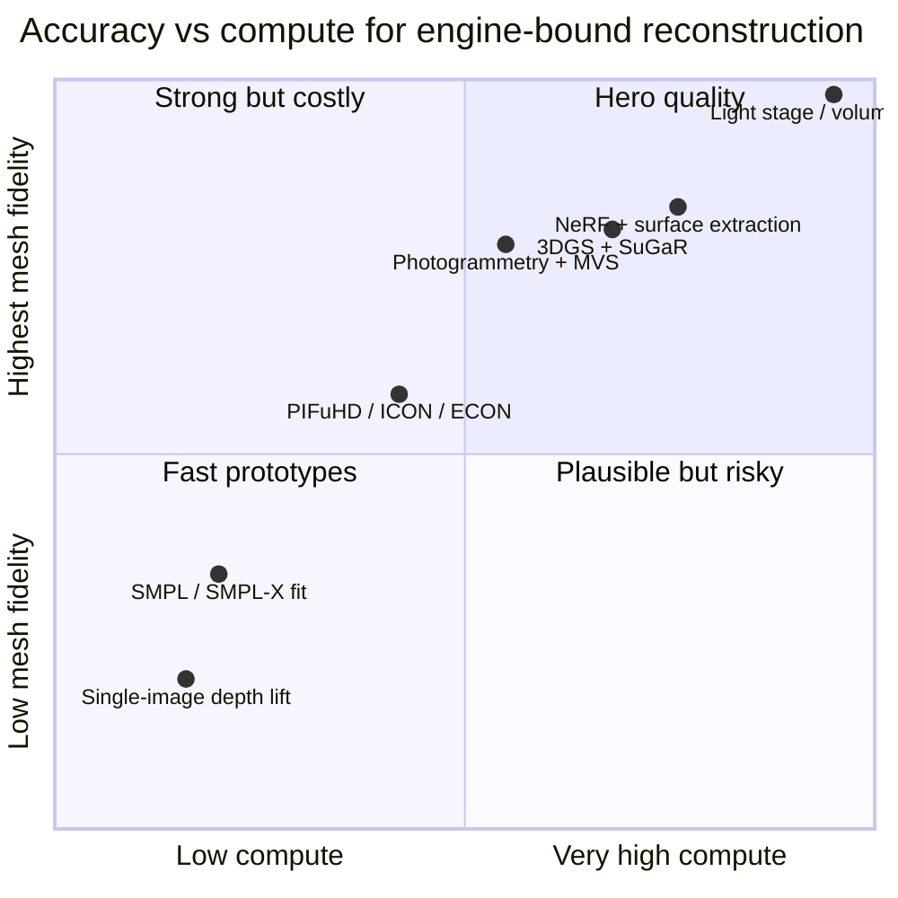
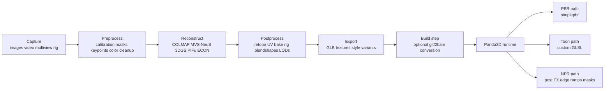

# Building Image-to-3D Mesh Systems for Accurate Human Reconstruction and Multi-Style Rendering

## Executive summary

Image-to-3D mesh systems now span a broad spectrum: classical photogrammetry based on Structure-from-Motion and Multi-View Stereo, learned MVS depth networks, radiance-field pipelines such as NeRF and 3D Gaussian Splatting, neural implicit surface methods such as NeuS and VolSDF, and human-specific pipelines that inject body priors through SMPL or SMPL-X and refine clothed geometry with systems such as PIFu, PIFuHD, ICON, and ECON. In practice, no single family dominates every requirement. The right answer depends on whether your priority is geometric truth, render quality, animation readiness, capture convenience, or runtime delivery into an engine such as Panda3D. citeturn38search0turn21search1turn38search1turn39search2turn38search6turn42search1turn39search3turn39search4turn42search4turn35search2turn9search4turn37view1turn10search0turn37view3turn41search1turn41search4

For highly accurate humans, the strongest practical recipe is still hybrid. Use synchronized multiview capture whenever possible, initialize body pose and coarse surface with a robust parametric prior such as SMPL-X, recover local facial detail with face-specific models such as FLAME and DECA, and then refine free-form cloth and hair with a human reconstruction or neural-surface stage. Single-image systems are now good enough to create convincing avatars, but they still infer invisible geometry from learned priors rather than direct evidence; that difference matters whenever you care about back views, under-arm regions, loose garments, dense hair, or identity-faithful geometry. citeturn41search4turn37view6turn37view5turn40search1turn23search0turn23search1turn9search4turn37view1turn10search0turn37view3

For Panda3D specifically, the least risky shipping pipeline is usually offline reconstruction followed by explicit asset baking: retopologized mesh, UVs, baked textures, rigging, facial blendshapes, and LODs exported as GLB, with optional conversion to BAM for faster loads. Panda3D’s documentation strongly favors glTF for interchange, recommends the `panda3d-gltf` loader over the generic Assimp path, supports Actor-based animation, and provides the shader, postprocess, LOD, instancing, compute-shader, and profiling hooks needed to render PBR, toon, and broader NPR styles at runtime. citeturn16search0turn16search4turn34search2turn16search3turn17search1turn31search2turn18search1turn31search0turn31search1turn18search3

If I had to reduce the design space to three default choices, I would use classical photogrammetry or learned MVS for static scenes and props, multiview neural surfaces or 3D Gaussian Splatting plus mesh extraction for high-fidelity static humans, and neural-avatar or volumetric-capture systems for dynamic performers, with the final runtime asset still baked back to explicit meshes or geometry caches for Panda3D unless you are ready to write a custom radiance-field renderer. citeturn38search0turn21search1turn38search1turn39search2turn39search3turn42search4turn35search2turn36search8turn36search9turn36search12

## Reconstruction method landscape

Classical geometry-first pipelines still matter because they optimize for precisely the thing an engine wants: explicit geometry. A typical chain uses COLMAP for camera calibration, sparse SfM, and dense stereo preparation, then OpenMVS or a similar stage for densification, surface extraction, and texturing. This stack remains especially compelling for static subjects and controlled captures because it does not require task-specific training data, and its outputs are already close to engine-friendly meshes. citeturn38search0turn38search8turn21search1

Learned MVS methods keep the calibrated multiview assumption but replace hand-crafted stereo costs with learned cost volumes. MVSNet constructs a reference-camera frustum cost volume through differentiable homography warping and uses 3D convolutions to regress depth, while PatchmatchNet trades some of the heavy 3D cost-volume machinery for a patchmatch-style cascade that lowers memory use and improves practical resolution. These methods are strong when you have several well-calibrated views and you want dense depth quickly, but they are less comfortable than human-prior methods when pose articulation and free cloth dominate the problem. citeturn38search1turn38search9turn39search2turn39search20

Radiance-field methods move the emphasis from direct mesh recovery to view-consistent appearance modeling. NeRF represents a scene as a continuous radiance field optimized from posed images; Instant-NGP makes this family much more practical by using multiresolution hash encodings and demonstrating near-instant training on a single GPU; and 3D Gaussian Splatting goes further toward realtime rendering with anisotropic splats and visibility-aware rasterization. Their weakness, from an engine-integration perspective, is that mesh extraction is secondary rather than native. That is why surface-centric descendants matter: VolSDF formulates density through a transformed signed distance function, and NeuS introduces an SDF-based volume rendering formulation designed for more accurate surface reconstruction. citeturn38search6turn38search2turn42search1turn42search4turn39search4turn39search3

Human-specialized methods add a prior that the generic families lack. PIFu and PIFuHD align image features to implicit 3D queries so they can recover clothed humans from one or more images, including hallucinated unseen regions; ICON uses local features and SMPL-type body priors to gain robustness on in-the-wild poses; and ECON explicitly predicts front and back normal maps, lifts them to partial surfaces, and uses SMPL-X as a structural canvas so it can handle looser garments and more difficult poses than many earlier monocular methods. These families are far better than generic meshes when the subject is a person, but still live on a realism ladder: parametric body fidelity is high, free cloth fidelity is improving, and exact hair and hidden-surface fidelity remain the hardest parts. citeturn9search4turn37view1turn10search0turn10search6turn37view3turn41search4

The newest feed-forward “large reconstruction model” family is worth watching because it changes the economics of inference. LRM predicts a NeRF-like representation from a single image in seconds, while GS-LRM and GRM compress sparse-view reconstruction into very fast feed-forward Gaussian prediction. These models are promising for rapid asset prototyping, but the strongest public results are still concentrated in objects and scenes rather than identity-critical humans; I would currently treat them as acceleration layers or candidate front ends, not as the foundational method for hero-quality human digitization. citeturn30search0turn30search5turn30search15

| Family | Typical input | Training data or priors | Mesh accuracy for export | Compute | Main strengths | Main weaknesses |
|---|---|---|---|---|---|---|
| Classical photogrammetry and MVS | Many overlapping images, calibrated or self-calibrated | None | High for static scenes | Medium to high optimization cost | Explicit geometry, predictable outputs, no task training | Sensitive to motion, weak on free hair and difficult materials |
| Learned MVS | 3 to 7+ calibrated views | Large multiview datasets | High when calibration is clean | High GPU cost | Dense depth at good quality, faster than many older learned methods | Still needs calibrated overlap, limited human priors |
| NeRF and Instant-NGP | Posed multiview images | Often scene-specific training or large pretraining | Moderate unless paired with surface extraction | High, but much lower with Instant-NGP | Excellent novel views, dense appearance | Mesh is indirect, slower for production baking than classical outputs |
| NeuS and VolSDF | Posed multiview images | Scene-specific optimization over SDF fields | High | High | Much better surfaces than raw radiance fields | Still heavier than classical photogrammetry |
| 3D Gaussian Splatting and SuGaR | Posed multiview images | Scene-specific optimization | High with SuGaR-style extraction | Medium to high | Fast training, realtime rendering, improving mesh extraction | Native representation is not a mesh |
| Parametric human models | 1+ images, video, or mocap | Human body scan priors | Moderate by themselves, high for pose coherence | Low to medium | Animation-ready, stable body topology | Limited free cloth, hair, and accessories |
| Human implicit or explicit monocular methods | 1 to a few human images | Human scans, masks, body priors | Moderate to high | Medium to high | Excellent for plausible clothed humans from sparse input | Hidden regions remain inferred |
| Large reconstruction models | 1 to 4 images | Massive multiview corpora | Moderate today | Low inference, extreme pretraining cost | Very fast inference | Human fidelity still volatile |

*Table note.* The ratings above are qualitative and synthesize the source papers and official project pages. “Mesh accuracy” refers to geometry suitable for explicit export, not only to novel-view PSNR. citeturn38search0turn21search1turn38search1turn39search2turn38search6turn42search1turn39search3turn39search4turn42search4turn35search2turn41search1turn9search4turn37view1turn10search0turn37view3turn30search0

The next chart is intentionally qualitative. It should be read as a design aid, not a benchmark leaderboard. It compresses the cited literature into one practical question: if your output must become a shippable mesh, where do the big families sit in the accuracy-versus-compute trade space? citeturn38search0turn38search1turn39search2turn38search6turn42search1turn39search3turn42search4turn35search2turn9search4turn37view3



## Human-specific capture and modeling

Humans are the hardest reconstruction target because they combine nonrigid motion, frequent self-occlusion, thin and topologically messy regions such as hair and fingers, loose textiles, and an unusually high perceptual sensitivity to facial error. That is why modern human pipelines nearly always begin with a landmark or pose stage. OpenPose uses part affinity fields for realtime bottom-up multi-person 2D association; HybrIK explicitly bridges 3D joints and body-model parameters through hybrid inverse kinematics; EasyMocap packages multiview motion capture and even includes a dedicated multiple-person-from-multiple-calibrated-cameras workflow; and SMPL-X plus SMPLify-X give you an expressive body, face, and hands model that already fits graphics-style animation conventions. citeturn40search13turn23search1turn23search0turn23search8turn41search4turn41search5turn41search17

This leads to an important implementation principle: human reconstruction is usually more stable if you split the problem into at least two layers. First solve coarse semantics and articulation with keypoints, body priors, masks, and camera calibration. Then solve fine appearance and geometry. PIFu and PIFuHD do this implicitly through image-conditioned implicit geometry. ICON and ECON do it more explicitly by bringing the body prior into the geometry refinement loop, with ECON in particular using front and back normals and SMPL-X-guided stitching to preserve challenging clothing shapes. citeturn9search4turn37view1turn10search0turn37view3turn41search4

### Capture rigs and acquisition tiers

At the high end, dense synchronized rigs dominate. The ZJU-MoCap dataset uses a 20+ synchronized camera system for dynamic humans, DNA-Rendering scales to 60 synchronized cameras with actor, outfit, and material annotations, and commercial full-body scanning examples include dense DSLR rigs such as Renderpeople’s 250-camera setup and multi-camera systems such as 3dMD, which advertises near-ground-truth dense-surface accuracy with linear accuracy around 0.2 mm or better. These systems work because they minimize temporal mismatch while preserving enough angular coverage to constrain hidden surfaces. citeturn11search0turn12search18turn12search2turn12search1turn22search10turn22search2

At the emerging “hero capture” end, the gap between geometry and reflectance is addressed by light stages and related photometric systems. The Light Stage line of work captures how a face appears under many lighting directions, while The Relightables extends that spirit to full-body capture with a custom geodesic sphere containing 331 LED lights plus high-resolution cameras and depth sensors. Dynamic multiview photometric stereo also matters here because it recovers dynamic normals and reflectance detail beyond what ordinary stereo can resolve. If your application needs film-quality digital doubles, this territory is still unmatched. citeturn40search10turn40search2turn36search9turn36search20turn40search3

At the practical indie tier, a controlled orbit video or a small synchronized camera ring can be enough if you commit to priors and cleanup. In that regime, I would typically fit SMPL-X, estimate face detail with DECA, use ICON or ECON for clothed body geometry, and only trust direct evidence for visible hair silhouette while reconstructing fine strands with a specialized hair method if the hairstyle is important to the result. Monocular body systems can absolutely produce good game assets, but the last fifteen percent of realism still comes from capture quality, not from network cleverness alone. citeturn41search4turn37view5turn10search0turn37view3turn24search6turn24search18

### Occlusion, hair, cloth, and face detail

Multi-person occlusion is best addressed early, not late. A robust multiview stack usually runs per-view detection and segmentation first, then cross-view association, then temporal tracking, and only then per-person fitting or surface reconstruction. EasyMocap’s multiview multi-person tooling, combined with bottom-up detectors such as OpenPose, is a practical open-source example of this design. The reason is simple: once the wrong body parts are associated across views, later mesh optimization tends to amplify the error instead of removing it. citeturn23search8turn23search0turn40search13

Hair deserves separate treatment because coarse human methods mostly capture silhouette-level volume, not strand structure. Older multiview work reconstructed hair geometry from multiple images, and newer systems now explore strand reconstruction through 3D Gaussian Splatting. In production terms, that means you should decide early whether the project needs “hair as surface cards or volume” or true groom-level strands. Most game-bound pipelines should choose cards, shells, or simplified groom exports unless the application is close-up cinematics. citeturn24search6turn24search18

Clothing is similarly stratified. Tight garments are well-covered by parametric priors; loose garments are not. ICON improves robustness through local-feature implicit geometry tied to SMPL-like priors, ECON goes further by explicitly lifting predicted front and back normals into 2.5D surfaces and stitching them with a body-model canvas, and recent work such as ReLoo shows how much loose garments still stress casual monocular pipelines. If jackets, skirts, coats, or layered fabrics are central to your application, this is the problem area where extra views most dramatically improve results. citeturn10search0turn37view3turn24search11

Facial detail should almost always be separated from full-body reconstruction. FLAME supplies an articulated head model with expression blendshapes and corrective terms learned from scans, DECA explicitly captures person-specific detail and expression-dependent wrinkles, and GANFit remains a useful example of GAN-based single-image high-fidelity face texture and shape fitting. In practice, you get better results by solving head detail on its own UV space and then merging head outputs into the body asset than by expecting a single body network to handle pores, wrinkles, teeth proximity, eyelids, and hairline detail all at once. citeturn37view6turn37view5turn14search3turn14search19

### Rare and emerging human methods

Neural-avatar and volumetric-capture systems are most valuable when the subject is dynamic. Total Capture unifies body, face, and hands into one seamless deformation model. Function4D targets very sparse consumer RGBD setups. DoubleFusion and RobustFusion illustrate how template fitting, implicit functions, and volumetric fusion can cooperate even with a single depth sensor or RGBD source. The trade-off is that these are often view-synthesis or performance-capture systems first and engine-ready asset systems second. Their output is often best treated as a source for mesh sequences, rigged avatar training data, or high-quality reference rather than as the runtime representation itself. citeturn36search10turn36search8turn36search12turn36search4turn36search13

| Human-focused approach | Best input | Geometry fidelity | Animation readiness | Hair and cloth handling | Best use |
|---|---|---|---|---|---|
| SMPL or SMPL-X fitting | 1+ RGB images or video | Moderate surface detail, high pose coherence | Very high | Hair and loose cloth are weak | Fast rig-ready avatars, initialization |
| PIFu and PIFuHD | Single image, optionally more views | Moderate to high | Moderate after cleanup | Better than pure parametric models, still inferred in occlusion | Sparse-input avatar creation |
| ICON and ECON | Monocular human image plus body prior | High for clothed humans, especially ECON | Moderate to high after retopo | Better handling of loose cloth than many monocular baselines | Single-image clothed human reconstruction |
| DECA plus FLAME plus GANFit | Face crop, portrait image, or short video | High on face | High via blendshapes | Head-focused only | Facial detail and expression |
| EasyMocap plus SMPL-X | Calibrated multiview | High coarse body fidelity | Very high | Needs a detail stage for hero cloth or hair | Markerless motion capture and initialization |
| Volumetric or neural-avatar systems | Dense multiview or RGBD capture | Very high for dynamic free-view rendering | High for captured performance | Strong for performance appearance, weaker for direct engine export | Dynamic performers and telepresence |
| Light stage or photometric studio | Specialized multilight rig | Highest | High after pipeline work | Strongest for face reflectance and microdetail | Digital doubles and hero renders |

*Table note.* These ratings synthesize the primary papers and official project pages and are meant for production planning, not for replacing per-benchmark comparisons. citeturn41search1turn41search4turn9search4turn37view1turn10search0turn37view3turn37view6turn37view5turn14search3turn23search0turn36search10turn36search8turn36search9turn40search2

## Data, training, and evaluation

The strongest datasets and training corpora differ by subproblem. CAPE provides dynamic clothed human registrations with consistent topology and body-shape-under-clothing information; THuman2.0 provides about 500 high-quality scans captured by a dense DSLR rig; DNA-Rendering adds scale, multiview video, SMPL-X fits, keypoints, masks, and materials across hundreds of actors and outfits; and AGORA raises the bar for whole-body pose-and-shape evaluation by including face and hand complexity rather than only sparse major joints. If you are building a general human model rather than a one-off subject-specific solver, those are the right kinds of corpora to anchor around. citeturn11search1turn13search0turn12search18turn12search2turn12search3turn27search5

Preprocessing is rarely glamorous, but it decides whether optimization or learning will converge. For classical pipelines, accurate calibration, sufficiently overlapping images, sharp focus, and exposure stability remain foundations, as reflected in the official COLMAP tutorial and practical Instant NeRF guidance. For humans, add segmentation masks, face and hand landmarks, body keypoints, and where possible color normalization across views. The best pipelines also preserve per-view metadata all the way through export so later re-rendering and debugging remain possible. citeturn38search8turn42search5turn21search15turn40search13turn37view5

For depth-from-single-image, modern depth priors are increasingly useful as auxiliary geometry, not as final geometry. MiDaS frames robustness as a large-diverse-training-set problem, Marigold repurposes diffusion-model priors and fine-tunes on synthetic data, and Depth Anything V2 pushes scale even further with 595K synthetic labeled images and 62M+ real unlabeled images. In a human pipeline, these depth priors are excellent for coarse backfilling, cropping, and regularization, but they should be fused with human priors and multiview evidence whenever accuracy matters. citeturn14search16turn14search14turn14search2turn14search5

Fine-tuning strategy should follow representation. Parametric fits usually benefit from staged optimization over keypoint reprojection, silhouette alignment, and pose or shape priors. Human implicit methods benefit from a strong body initialization and then detail refinement. Neural rendering methods benefit from precise camera poses, aggressive background cleanup, and coarse-to-fine schedules. Surface-oriented neural methods benefit from explicit SDF or normal regularization. Differentiable rendering libraries such as PyTorch3D, nvdiffrast, and redner are especially useful when you need image-space supervision to push geometry, texture, or articulation into agreement with the inputs. citeturn41search17turn37view3turn39search3turn39search4turn15search8turn15search1turn15search3

| Representation family | Common supervision and loss terms | Typical evaluation metrics |
|---|---|---|
| Classical SfM and MVS | Reprojection error, bundle adjustment residuals, photo-consistency, depth fusion consistency | Accuracy, completeness, F-score on benchmarks such as DTU |
| SMPL or SMPL-X fitting | 2D keypoint reprojection, silhouettes, pose or shape priors, interpenetration penalties | MPJPE, PA-MPJPE, PVE or MVE, benchmark scores on AGORA and related sets |
| Human implicit or explicit monocular methods | Occupancy or SDF loss, normal loss, color loss, front-back consistency, body-prior regularization | Chamfer distance, normal consistency, perceptual studies, dataset-specific body metrics |
| NeRF, Instant-NGP, 3DGS | Photometric RGB loss, mask loss, sparsity and regularization terms | PSNR, SSIM, LPIPS, increasingly perceptual or no-reference quality measures |
| NeuS and VolSDF | Photometric rendering loss plus SDF regularization such as Eikonal-style constraints | Surface reconstruction accuracy, completeness, F-score, rendering metrics |
| Facial detail models | Landmark loss, photometric reconstruction, expression or identity priors, detail displacement supervision | Landmark error, perceptual realism, identity and expression consistency |

*Table note.* This summary compresses common practice across the cited papers and benchmark documentation. Exact formulas differ across implementations, but the categories are stable and useful for system design. citeturn27search16turn27search1turn28search2turn38search6turn39search3turn39search4turn37view5turn41search17turn9search4turn37view3

A practical training rule follows from the sources: if your data are sparse or noisy, lean harder on priors; if your capture is rich and calibrated, lean harder on geometric evidence. That is why SMPL-X, FLAME, and monocular recon networks perform best as initializers under weak data, while multiview neural surfaces and dense photogrammetry shine under strong capture. It is also why subject-specific fine-tuning is often worth the effort for hero assets: it narrows the gap between generic priors and the specific person in front of the camera. citeturn41search4turn37view6turn37view3turn38search0turn39search3turn35search2

## Postprocessing, export, and render styles

Once geometry exists, the most important question becomes: what form should survive to runtime? Nerfstudio’s export tools make the point clearly by supporting point clouds, several mesh extraction paths, and Gaussian exports, while SuGaR shows how a fast neural rendering representation can be converted back into editable meshes through surface alignment and Poisson reconstruction. In production, this is often where you decide how much of the neural representation should remain native and how much should be baked. For Panda3D, I would usually bake aggressively. citeturn21search2turn21search6turn35search2turn35search6

Retopology, UVs, and texture baking remain essential even in 2026. Blender’s documentation is still a good reference point here: retopology exists precisely because sculpted or scanned meshes often deform poorly; UV unwrapping organizes texture space for painting and baking; and render baking converts high-detail information into normal, AO, roughness, and other maps suitable for real-time use. xatlas is a compact option when you want programmatic UV generation for baking or lightmaps. citeturn26search4turn25search6turn26search0turn25search1

For rigging, a strong body prior can save enormous time. SMPL already ships as a graphics-friendly body model based on skinning and blend shapes, and SMPL-X extends that idea to a unified expressive body with face and hands. Still, scan-derived topology is rarely what you want for final skinning. My usual rule is to preserve the reconstructed mesh as reference, then build or auto-generate a cleaner animation mesh, transfer weights, and bake high-frequency detail back through normal, displacement, or wrinkle maps. Facial expression should usually live in blendshape space. FLAME and DECA are especially useful for generating those expression controls and head-specific detail. citeturn41search1turn41search4turn37view6turn37view5

LOD generation should happen before engine import, not after. Panda3D has LOD support, but the source meshes should already be authored as deliberate high, medium, and low variants with style-appropriate texture resolutions. Simplygon remains one of the clearest commercial references for automated reduction and LOD-distance estimation, and even if you use Blender or custom simplification, the same principle holds: allocate polygon budget by screen contribution, not by reconstruction enthusiasm. citeturn18search1turn18search5turn25search9turn25search13

| Need | Best interchange choice | Why it fits | Panda3D implication |
|---|---|---|---|
| Real-time PBR mesh asset | GLB or glTF 2.0 | Efficient runtime asset delivery with core PBR semantics | Default choice for shipping assets |
| Neural reconstruction intermediate | OBJ or PLY from exporter | Many research tools output these directly | Usually convert in a DCC before final import |
| Layered studio scene interchange | OpenUSD | Strong composition and scene description | Great upstream, generally convert before Panda runtime |
| Animated geometry cache | Alembic | Efficient application-independent geometry caching | Best as an intermediate or for tool-side processing |
| Material lookdev graphs | MaterialX | Open standard for rich shading, including PBR and NPR node libraries | Bake or rewrite into Panda shaders for runtime |

*Table note.* The format recommendations reflect the official specifications and tool docs, plus the realities of Panda3D’s mesh-centric runtime import path. citeturn19search0turn20search0turn20search10turn19search2turn19search3turn19search23turn16search0turn34search2turn21search2

For multiple render styles, I would keep one canonical geometry asset and vary the material payload. For PBR, stick close to glTF’s standard material workflow. For toon or cel shading, preserve the same mesh and UVs, but export style-support textures such as flat albedo, ID maps, baked curvature, and AO, then re-shade in Panda3D. For broader NPR, MaterialX’s NPR node library is useful in the DCC or lookdev stage, but I would still bake down to textures or rewrite the look as custom GLSL in Panda rather than expecting cross-tool shader graphs to survive exactly. glTF’s `KHR_materials_unlit` is useful for flat or stylized passes, and `KHR_materials_variants` is valuable upstream if you want one source asset carrying several material looks. citeturn19search0turn19search16turn32search1turn32search4turn32search14turn32search2turn17search1turn32search0

## Tools and services

The open-source stack is now strong enough to cover almost every stage of an image-to-mesh pipeline. COLMAP and OpenMVS cover classical reconstruction. Meshroom exposes the photogrammetry graph visually through AliceVision nodes. Nerfstudio reduces the practical cost of working with NeRF-style pipelines and has a well-documented export path. PIFuHD, ICON, ECON, SMPL-X, EasyMocap, HybrIK, OpenPose, and MMPose cover most of the open human stack. PyTorch3D, nvdiffrast, Kaolin, and redner cover differentiable rendering and lower-level 3D learning infrastructure. Blender, xatlas, and your simplifier of choice finish the asset for runtime. citeturn38search0turn21search1turn21search0turn21search2turn37view1turn10search0turn37view3turn41search16turn23search0turn23search1turn40search13turn23search2turn15search8turn15search1turn15search2turn15search3turn25search1turn26search0

| Open-source toolset | Best stage | Why it matters | Main caution |
|---|---|---|---|
| COLMAP plus OpenMVS | Classical reconstruction | Strong explicit geometry chain | Static capture works better than moving humans |
| Meshroom plus AliceVision | Node-based photogrammetry | Easier experimentation and graph editing | Still inherits classical capture constraints |
| Nerfstudio | Neural rendering and export | Practical training, viewers, and export tools | Mesh extraction still needs curation |
| PIFuHD, ICON, ECON | Human reconstruction | Strong sparse-input human priors | Cleanup is still mandatory for shipping |
| SMPL, SMPL-X, SMPLify-X | Body prior and rig initialization | Animation-friendly topology from the start | Not enough detail by themselves |
| OpenPose, EasyMocap, HybrIK, MMPose | Keypoints and mocap bootstrapping | Solves the hardest semantic ambiguity early | Downstream stages still need good masks and calibration |
| PyTorch3D, nvdiffrast, redner, Kaolin | Differentiable optimization and research | Flexible loss-driven reconstruction work | Deeper engineering effort than turnkey tools |

For commercial services, the decision is less about “best algorithm” and more about where you want to spend your complexity budget. RealityScan gives you an industrial photogrammetry workflow. entity["company","3dMD","3d imaging company"] is compelling when you need dense, fast human capture. entity["company","Artec","3d scanner maker"] broadens access to photo or video based capture and scanner-centric workflows. entity["company","Polycam","3d capture app"] is attractive when you value speed and accessible exports over maximum control. entity["company","Twindom","3d body scanner company"] is built around full-body scanning products. entity["company","Renderpeople","scanned humans vendor"] is less a reconstruction tool than a source of professionally scanned people for reference, bootstrapping, or direct content licensing. entity["company","Autodesk","3d design software"] also exposes an official Reality Capture API for high-resolution textured meshes and dense point clouds. citeturn21search15turn21search3turn22search2turn22search10turn22search0turn22search4turn22search1turn22search9turn22search3turn22search7turn12search1turn12search9

| Commercial option | Best at | Why you would choose it | Main limitation |
|---|---|---|---|
| RealityScan | Professional photogrammetry and reality capture | Mature reconstruction and API path | Commercial workflow and licensing overhead |
| 3dMD systems | Fast, accurate human capture | High-fidelity multiview body or face geometry | Specialized hardware and studio setup |
| Artec Studio | Scanner-driven and photo-based workflows | Unified commercial capture environment | Cost and export restrictions by tier |
| Polycam | Fast mobile-first capture | Convenient exports and accessible UX | Less control than a custom calibrated pipeline |
| Twindom | Full-body scanning products | Turnkey avatar or figurine-oriented capture | Less flexible than a custom research stack |
| Renderpeople | Ready-made scanned humans | Excellent source assets and references | Not a reconstruction pipeline for your own captured subject |

## Panda3D integration patterns

The safest Panda3D architecture is simple: keep reconstruction out of the realtime loop, deliver explicit assets into the engine, and let Panda concentrate on scene management and rendering. The data flow below reflects that philosophy. It matches Panda3D’s strongest documented paths: glTF import, optional BAM conversion, Actor animation, custom GLSL shaders, postprocessing buffers, LODs, and profiling. citeturn16search0turn16search4turn34search2turn16search3turn17search1turn31search2turn18search1turn18search3



A practical build pipeline often looks like this. Capture a subject, solve cameras and semantics, reconstruct geometry, clean and bake in a DCC, export GLB, then optionally convert to BAM for distribution. Panda3D’s Blender conversion guidance, glTF loader docs, and `gltf2bam` support make this straightforward. The important design choice is that your source of truth remains the editable DCC or GLB asset, while the BAM is a deployable runtime artifact. citeturn34search7turn16search0turn34search2

```python
# panda_avatar_demo.py
from direct.showbase.ShowBase import ShowBase
from direct.actor.Actor import Actor
from panda3d.core import Shader
import simplepbr

class AvatarApp(ShowBase):
    def __init__(self):
        super().__init__()

        # PBR renderer for glTF assets
        simplepbr.init(
            enable_shadows=True,
            use_normal_maps=True,
            use_occlusion_maps=True,
        )

        # Load the rigged runtime asset exported from your DCC
        self.avatar_pbr = Actor("assets/avatar_rig.glb")
        self.avatar_pbr.reparentTo(self.render)
        self.avatar_pbr.setPos(0, 6, -1)
        self.avatar_pbr.loop("Idle")

        # Alternate toon-shaded copy for style switching
        toon_shader = Shader.load(
            Shader.SL_GLSL,
            "shaders/toon.vert",
            "shaders/toon.frag"
        )
        self.avatar_toon = self.avatar_pbr.copyTo(self.render)
        self.avatar_toon.setShader(toon_shader)
        self.avatar_toon.hide()

    def set_style(self, style: str) -> None:
        use_toon = (style == "toon")
        self.avatar_pbr.show() if not use_toon else self.avatar_pbr.hide()
        self.avatar_toon.show() if use_toon else self.avatar_toon.hide()

app = AvatarApp()
app.run()
```

This style-switch approach is intentionally boring, which is exactly why it works. Panda3D’s shader docs recommend GLSL for new work, the cartoon-shader sample shows a thresholded-lighting plus outline pattern, and simplepbr gives you an easy PBR baseline for glTF assets. If you need deeper NPR, add a postprocess stage that renders normals or depth to textures and outlines in a fullscreen pass through Panda’s render-to-texture or FilterManager path. citeturn17search1turn32search0turn31search2turn31search14turn34search1

Performance tuning in Panda3D is mostly about reducing draw pressure and load overhead once your reconstruction has already been normalized into engine assets. Use `LODNode` for hero bodies and crowds. Use `flattenStrong()` only on static subtrees where you truly want to trade flexibility for fewer meshes. Instance repeated props or accessories. Convert stable GLB assets to BAM when startup time matters. Then confirm the effect with PStats instead of guessing. Panda’s own docs explicitly warn that flattening can break later movement and culling assumptions if you apply it indiscriminately. citeturn18search1turn16search6turn31search0turn34search2turn18search3

GPU and CPU separation matters more than many engine integrations admit. Reconstruction training, large neural inference, and heavy texture baking should usually happen offline or in a separate worker process, not in Panda’s main loop. Panda does expose task and threading infrastructure, but the more sophisticated the reconstruction stack becomes, the more valuable it is to isolate it into a build step or service and pass only engine-ready artifacts back to the runtime. That keeps interactivity stable and makes deployment far easier across machines that may not have the same CUDA stack or VRAM budget. citeturn18search20turn17search19turn42search3turn17search0

## Recommendations

If your starting point is a single portrait image and the goal is a plausible interactive human, the most pragmatic pipeline is SMPL-X initialization, monocular pose and landmark estimation, an image-conditioned human recon model such as ECON or ICON, separate head refinement with DECA or GANFit, then manual or semi-automatic cleanup before export. This route is efficient, but its geometry will still be prior-driven in occluded regions, so it is best for avatars, not for maximum-fidelity digital doubles. citeturn41search4turn23search1turn37view3turn10search0turn37view5turn14search3

If you can capture a cooperative person with either a short synchronized-camera sweep or a careful orbit video, move immediately to a hybrid multiview stack. Use COLMAP for camera structure, a body prior for semantic stability, and then either a neural-surface route such as NeuS or VolSDF or a 3DGS route that you later convert with SuGaR. This is the best trade-off I know between fidelity, research maturity, and eventual mesh export for engine use. citeturn38search0turn39search3turn39search4turn42search4turn35search2turn41search4

If you need genuinely high-end humans with dense cloth, face, and relighting quality, do not try to outsmart capture physics. Use a dense multiview rig, or a light-stage or volumetric studio workflow, and treat neural methods as refiners rather than as replacements for capture. The public evidence from ZJU-MoCap, DNA-Rendering, The Relightables, and 3dMD-style systems points in the same direction: the more synchronized views and lighting control you have, the less your model must hallucinate. citeturn11search0turn12search18turn36search9turn22search10

For Panda3D deployment, I would standardize the pipeline around one canonical mesh asset per character, three authored style packs, and explicit LODs. The style packs should be PBR, toon, and one project-specific NPR look. Export them as GLB-based variants in your content pipeline, bake anything procedural, convert stable builds to BAM, and keep the runtime focused on rendering rather than reconstruction. That design aligns the strongest reconstruction research with the strongest Panda3D tooling instead of forcing either side to do a job it was not built for. citeturn19search0turn32search2turn32search14turn34search2turn34search1turn18search1